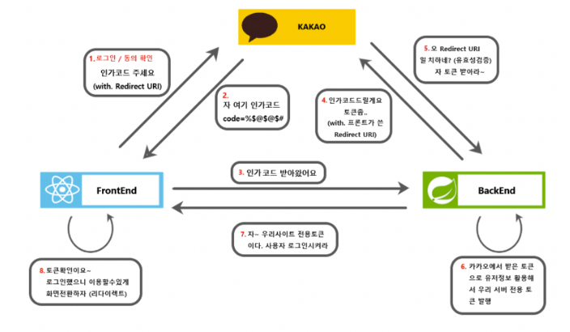
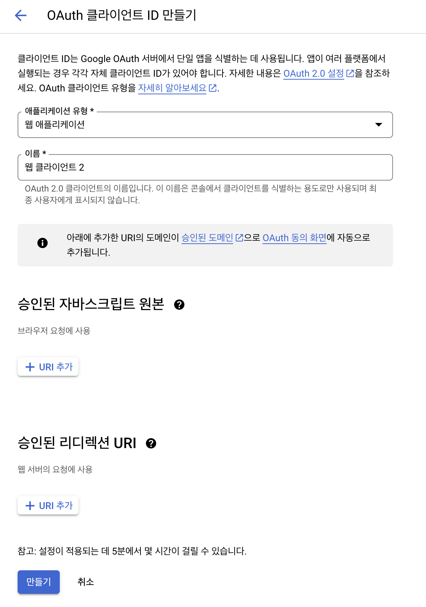

# Iceberg

## OAuth를 사용해보며

### OAuth 2.0 (**Open Authorization 2.0) 란?**



흔히 보는 간편로그인을 구현하기 위하여 `OAuth 2.0`방식을 사용한다.

OAuth는 인증을 위한 개방형 표준 프로토콜로 , Third-Party 프로그램에게 리소스 서버에서 제공하는 자원에 대한 접근 권한을 위임하는 방식을 제공한다.

자세한 과정은 다음과 같다.

1. 클라이언트에서 유저가 요청을 보낸다 (여기서는 간편로그인 시도)
2. OAuth 서비스 제공자가 클라이언트에 인가코드를 제공한다.
3. 클라이언트가 인가코드를 서버에 전송한다.
4. 서버에서 서비스 제공자에게 인가코드를 전송한다.
5. 인가코드가 유효한지 확인하고 서버에게 토큰을 제공한다.
6. 이 토큰을 통해 자체 서버 토큰을 발행한다.
7. 자체 토큰을 클라이언트에 제공한다.
8. 이후 클라이언트는 받은 토큰을 통해 유저 정보에 접근할 수 있다.

### Google OAuth

[클라이언트 측 웹 애플리케이션용 OAuth 2.0  |  Authorization  |  Google for Developers](https://developers.google.com/identity/protocols/oauth2/javascript-implicit-flow?hl=ko)

구글에서 제공하는 OAuth 인증 방식을 사용하려면 구글 클라우드 플랫폼에서 사용자 인증 정보를 등록해야 한다.



승인된 자바스크립트 원본은 호스팅하는 클라이언트의 웹 주소이고

승인된 리디렉션 URI는 인증 성공 시 되돌아갈 리디렉션 웹 주소이다.

만든 후 클라이언트 ID와 Secret을 저장하고 유출되지 않도록 조심한다.

OAuth 액세스 토큰을 받는 방법은 해당 엔드 포인트로 요청을 보내면 된다.

**[https://accounts.google.com/o/oauth2/v2/auth](https://accounts.google.com/o/oauth2/v2/auth) 가 해당 엔드 포인트이며 매개변수를 담아 보낸다.**

- client_id : 클라이언트 ID
- redirect_uri : 리디렉션 주소
- response_type : `token` 으로 설정하면 코드 교환 단계 없이 바로 액세스 토큰을 받을 수 있다.
- scope : 액세스 권한 범위 목록

```jsx
const googleOAuthUrl = `https://accounts.google.com/o/oauth2/v2/auth?client_id=${GOOGLE_CLIENT_ID}&
response_type=token&
redirect_uri=${GOOGLE_REDIRECT_URI}&
scope=https://www.googleapis.com/auth/userinfo.email`;
```

기본적인 유저 이메일만 받아올 것이므로 다음과 같이 scope를 설정하고 해당 url로 이동하면 사용자는 구글 로그인화면에서 로그인할 수 있다.

로그인 성공 시 설정한 리디렉션 주소로 되돌아가며 , 리디렉션 주소와 함께 액세스 토큰이 담겨져서 오게 된다.

### OAuth 어디서 처리해야 할까?

`OAuth` 인증 방식을 구현하면서 인증을 어디서 진행해야 하는지 헷갈렸다.

일단 테스트를 위하여 진행한 방식은 다음과 같다. (모든 것이 프론트에서 작동한다!)

1. 사용자가 로그인 버튼을 클릭한다.
2. OAuth 로그인 url로 이동시켜 , 사용자가 해당 OAuth에 로그인 한다.
3. 로그인이 성공하면 리디렉션 url로 되돌아오며 이때 `code`를 url 파라미터로 가져온다.
4. `code`를 이용해 `token` 으로 바꾼다.
5. 로그인 완료!

과정 중 프론트에서 `code` 까지는 문제 없이 받을 수 있었지만 , `token`으로 바꿀 때는 `CORS` 에러가 발생하여 `프록시 서버`를 설정하였다. (하지만 실제 구현에서는 이 과정을 백엔드 서버가 진행할 것이다.)

테스트 코드를 이렇게 작성하고 나서 , 이제 프론트에서 처리해야할 부분과 백엔드에서 처리할 부분을 나눠야 했다.

**프론트엔드**

- 사용자가 로그인 버튼을 클릭한다.
- OAuth 로그인 url로 이동시켜 , 사용자가 해당 OAuth에 로그인 한다.
- 로그인이 성공하면 리디렉션 url로 되돌아오며 이때 `code`를 url 파라미터로 가져온다.
- `code` 를 백엔드 서버에 전송한다.
- 백엔드로 부터 `200 코드`가 전송되면 , 사용자를 로그인 처리 한다.

**백엔드**

- 프론트엔드로부터 `code` 를 받는다.
- `code`를 이용해 `token` 으로 바꾼다.
- OAuth의 `token`으로 사용자 정보를 받아온다.
- 사용자 정보를 백엔드 DB와 대조하여 인가 과정을 거친다.
- 로그인 성공 시 프론트엔드에게 `200 코드`를 전달해준다. (이때 `JWT`인증방식이라면 , 백엔드 자체 발행 token을 전달해주어 후에 계속해서 로그인 되도록 한다.)

지금까지도 헷갈리는 부분은 프론트와 백이 같은 리디렉션 주소를 가져야 하는데 , 이를 둘 다에 같은 값을 넣어줄 지 , 아니면 한 쪽에서 생성하여 다른쪽이 가져올 지에 대한 부분이 헷갈린다.

진행하면서 느낀 생각으로는 , 백엔드에서 모든 OAuth 관련 코드를 가지고 있고, 프론트에서 요청할때마다 백엔드에서 코드를 가져오는 것이 보안적인 측면으로나 설계구조상 올바르다고 생각한다.
