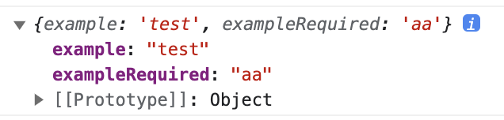
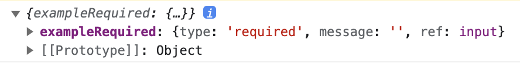

### 왜 react-hook-form을 사용했나?

`Iceberg` 프로젝트를 진행하며 , 사용자 입력을 받는 form이 필요했다.

물론 라이브러리를 사용하지 않고 , form에 input 필드를 넣고 , 그 값을 `ref` 나 `state` 로 관리하여 구성할 수 있다.

하지만 입력이 많아지고 , 관리해야할 부분이 많아진다면 ( validation 이 복잡해지는 등 ) 코드가 매우 길어지게 된다.

또한 state로 관리한다면 , 리렌더링이 많아지므로 ref 방식으로 구현해야 하는데 애로사항이 많았다.

이를 위해서 라이브러리인 `react-hook-form` 을 도입하게 되었다.

### [react-hook-form](https://www.react-hook-form.com/) 이 뭔가요?

자세한 내용은 공식 docs가 굉장히 잘 구성되어 있으며 , 예제도 친절하다.

```jsx
import { useForm, SubmitHandler, SubmitErrorHandler } from "react-hook-form";

type Inputs = {
  example: string;
  exampleRequired: string;
};

function App() {
  const {
    register,
    handleSubmit,
    formState: { errors },
  } = useForm<Inputs>();
  // 정상적으로 제출되었을 때 호출되는 함수
  const onSubmit: SubmitHandler<Inputs> = (data) => console.log(data);
  // 오류가 발생했을때 호출되는 함수
  const onError: SubmitErrorHandler<Inputs> = (data) => console.log(data);
  return (
    // handleSubmit 함수는 onSubmit이 호출되기 전에 input을 확인합니다.
    <form onSubmit={handleSubmit(onSubmit, onError)}>
      {/* register 함수를 통해 특정 부분을 검사하는 input을 만듭니다.   */}
      <input defaultValue="test" {...register("example")} />

      {/* 다음과 같이 required 필드를 추가하여 필수임을 확인할 수 있습니다. */}
      <input {...register("exampleRequired", { required: true })} />
      {/* 오류가 발생하면 errors를 통해 해당 오류가 나타났을때 행동을 부여할 수 있습니다. */}
      {errors.exampleRequired && <span>This field is required</span>}

      <input type="submit" />
    </form>
  );
}

export default App;
```

해당 코드는 required 필드가 있는 react-hook-form 예제이다.

기본적으로 `register` 를 이용하여 해당 필드를 검증하고 , 오류가 발생하면 , erros에 해당 필드의 이름이 오류로 발생하게 된다.

`handleSubmit`을 통해 , 해당 form이 제출되었을 때 검사하여 `onSubmit` 또는 `onError`를 호출한다.

- 정상적으로 제출됐을 때



- 오류가 발생했을 때



공식 docs를 보면 , `register`에 들어갈 수 있는 다양한 조건들이 있으므로 확인하여 코드를 작성해 나가면 된다.

복잡한 코드 없이 간단하게 input으로 이루어진 form을 구성할 수 있다는 점이 react-hook-form의 장점인 것 같다.
